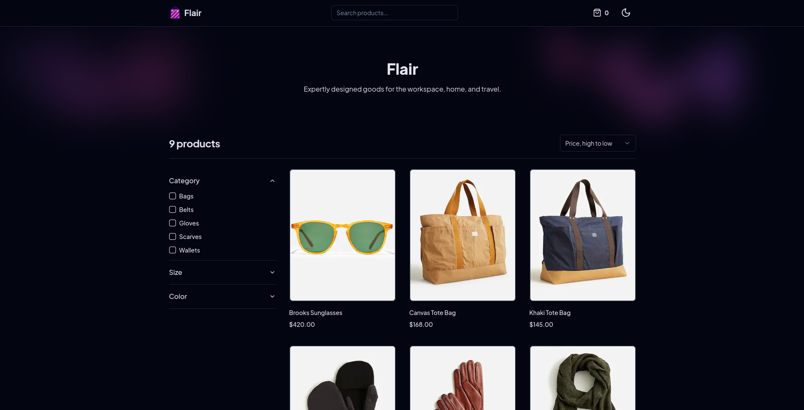

	<h1>E-commerce Application
	 
		
		
		
		
        
        
		 
	</h1>
	<h3> 👇 Check It Out 👇 </h3>

## 📝 Description

E-commerce App made with Next 13, Sanity, and Stripe from start to finish. This project has every major feature you would expect from a modern e-commerce app, such as an attractive and accessible user interface, a powerful shopping cart, where customers can add, update and remove items from their cart, the ability to sort products by different criteria, such as price and date, an advanced filter component, that enables users to select products according to properties such as category, size, and color, as well as a full-text search to find any product with ease.

## 🛠️ Built with

- Next 
- React 
- TypeScript 
- Tailwindcss 
- Sanity 
- Stripe 